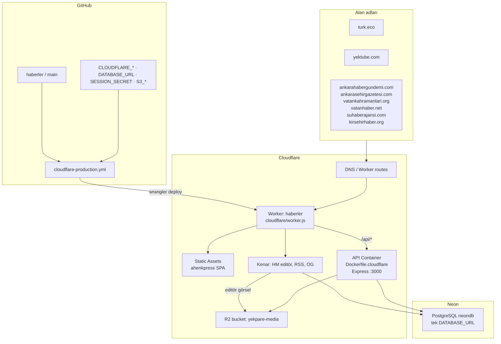
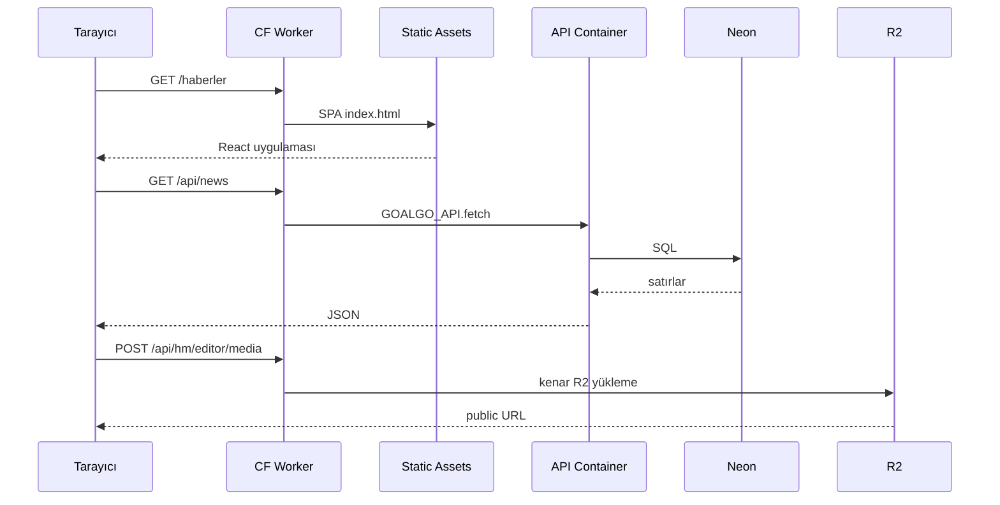

# turk.eco — GitHub + Neon + Cloudflare şeması

> **Hedef:** turk.eco ve bağlı Haber Merkezi (HM) alt siteleri yalnızca **GitHub + Neon + Cloudflare** üzerinde yayınlanır. Render kullanılmaz. Görseller Cloudflare R2’de tutulur.

---

## 1. Hedef mimari



**Tek origin:** tarayıcı `https://<host>/api/*` çağırır. Worker aynı istekte Container’a (Express) veya kenar Neon/R2 yoluna gider. Harici `onrender.com` vekili yoktur.

---

## 2. Katmanlar

| Katman | Nerede | Dosya |
|--------|--------|-------|
| Kaynak | GitHub `haberler` | `main` |
| CI/CD | GitHub Actions | `.github/workflows/cloudflare-production.yml` |
| SPA | CF Workers Static Assets | `artifacts/ahenkpress/dist/public` |
| Kenar router | Cloudflare Worker | `cloudflare/worker.js` |
| API | Cloudflare Container | `goalgo/Dockerfile.cloudflare` + `cloudflare/goalgo-api-container.js` |
| Veritabanı | Neon Postgres | `DATABASE_URL` |
| Medya | Cloudflare R2 (S3 API) | `S3_*` + `MEDIA_STORAGE_MODE=s3` |
| DNS | Cloudflare zones | `wrangler.toml` routes |

---

## 3. İstek akışı



---

## 4. Alan adları

| Alan adı | Amaç |
|----------|------|
| `turk.eco` | Ana portal |
| `yektube.com` | Yektube (`/yp`) |
| `ankarahabergundemi.com` | HM haber |
| `ankarasehirgazetesi.com` | ASG |
| `vatankahramanlari.org` | VKD |
| `vatanhaber.net` | Vatan Haber |
| `suhaberajansi.com` | Su Haber (`/tr/su`) |
| `kirsehirhaber.org` | Kırşehir Haber (`/tr/kh`) |

`yekpare.net` bu worker’da yoktur (ayrı repo).

---

## 5. Medya (Cloudflare R2)

| Anahtar | Değer |
|---------|--------|
| Mod | `MEDIA_STORAGE_MODE=s3` |
| Bucket | `yekpare-media` |
| Endpoint | `https://<accountid>.r2.cloudflarestorage.com` |
| Public | `S3_PUBLIC_BASE_URL` (r2.dev veya özel alan) |

Yeni yüklemeler Worker kenarından veya Container üzerinden R2’ye yazılır. Eski Render diski kullanılmaz.

Eski dosyalar hâlâ Render’daysa **bir kerelik** `LEGACY_MEDIA_ORIGIN` ile kopyalanıp secret silinir. Varsayılan olarak Render’a gidilmez.

---

## 6. GitHub Secrets

| Secret | Zorunlu |
|--------|---------|
| `CLOUDFLARE_API_TOKEN` | evet |
| `CLOUDFLARE_ACCOUNT_ID` | evet (`16f5b996194174624e7969a3658bd2bb`) |
| `DATABASE_URL` | evet (Neon, pooled, `sslmode=require`) |
| `SESSION_SECRET` | evet (≥16 karakter) |
| `S3_ENDPOINT` | evet (R2) |
| `S3_BUCKET` | evet (`yekpare-media`) |
| `S3_ACCESS_KEY_ID` / `S3_SECRET_ACCESS_KEY` | evet |
| `S3_REGION` | hayır (`auto`) |
| `S3_PUBLIC_BASE_URL` | hayır (önerilir) |
| `HM_EDITOR_JWT_SECRET` | hayır |
| `ADMIN_MAINTENANCE_SECRET` | hayır (R2 migrate workflow) |
| `AGENTLABS_URL` | hayır |

**Kullanılmayan:** `RENDER_DEPLOY_HOOK_URL`, `RENDER_API_ORIGIN`.

---

## 7. Kaldırılan Render yüzeyi

| Öğe | Durum |
|-----|-------|
| `API_ORIGIN=https://goalgo-y7ze.onrender.com` | Yok — Worker Container |
| `render-production.yml` | Kapalı |
| `render-keepalive.yml` | Kapalı |
| `render.yaml` | Yalnızca arşiv |
| Render disk / Postgres | Kullanılmaz |

Operasyon: Cloudflare deploy yeşil olduktan sonra Render dashboard’daki `goalgo-api` / `goalgo-call` ve Postgres örnekleri silinebilir.

---

## 8. Doğrulama

```bash
curl -sS -D- https://turk.eco/api/healthz | head
# x-yekpare-frontend: cloudflare-worker  (veya Container JSON 200)

curl -sS -o /dev/null -w "%{http_code}" https://turk.eco/
curl -sS -o /dev/null -w "%{http_code}" https://ankarahabergundemi.com/
```

Detaylı kurulum: [goalgo/docs/CLOUDFLARE-NEON-KURULUM.md](../goalgo/docs/CLOUDFLARE-NEON-KURULUM.md)
