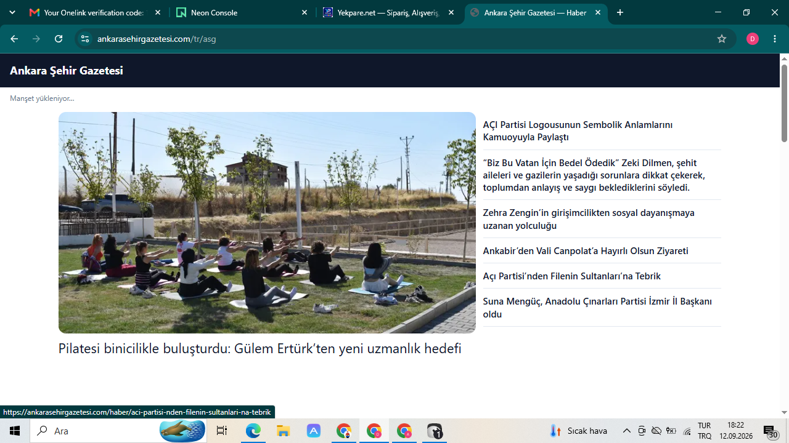
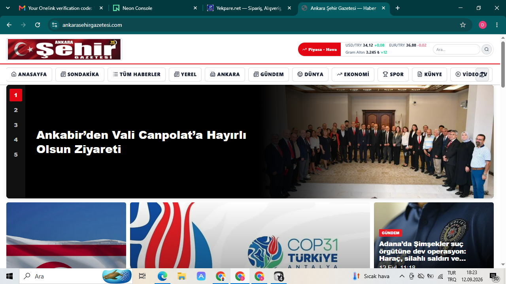

# Handoff — 12 Eylül 2026 (Dünya Sağlık / ahenkbt)

**PC:** DESKTOP-QORR5T9 (`C:\Users\CASPER`)  
**Amaç:** Cursor / Grok Bot hesap geçişi. Yarım işler, bağlantılar ve nasıl devam edileceği burada.

Bu dosya **public** repoya gider: şifre/token **yok**. Gerçek değerler:
- Bilgisayar / Grok box: `handoff/secrets-LOCAL-ONLY/CREDENTIALS-FULL.txt`
- GitHub Encrypted Secrets: `ahenkbt/haberler` → Settings → Secrets and variables → Actions

> **Güvenlik:** Bu dosyada **şifre / connection string / token yok**. Neon, GitHub, Cloudflare secret’ları console / Secrets’tan alınır; sohbete yapıştırma.

Yeni Cursor / Grok Bot hesabında: bu dosyayı oku → LOCAL secret dosyasını yükle → aşağıdaki “Yarım kalanlar”ı bitir.

---

## Repo / hesaplar

| Ne | Değer |
|----|--------|
| GitHub repo | https://github.com/ahenkbt/haberler (**public**) |
| Org/user | `ahenkbt` |
| CF account | `16f5b996194174624e7969a3658bd2bb` |
| Workers | `haberler` (HM+ahenk), `yektube` (yektube.com), ayrıca hesapta: `aiaddin-platform`, `goalgo-crm`, `yekpare-mailbox-email` |
| Neon project host | `ep-billowing-salad-b2m8d9jy` (eu-central-1) |
| Neon DB (haber) | `neondb` |
| Neon DB (eski yektube denemesi) | `yektube` (küçük; asıl video Hostinger’da) |
| Hostinger Postgres | `187.77.84.201:32768` DB `yektube` |
| R2 bucket | `yekpare-media` |
| Panel test user | `ahenkbt` (şifre LOCAL dosyada) |
| Deploy | GitHub Actions + Cloudflare (`cloudflare-production.yml` / wrangler) |
| Ana dal (bu birleşim) | `main` @ `2da124c9` (2026-09-12; #263 sonrası) |

---

## Bugün yapılanlar (merged PRs)

- **#244** yektube list lite select (Hostinger CPU)
- **#245** HM origin budget 2.5s→12s
- **#246** container standard-3 ×4 + observability
- **#247** Yektube Worker split + Faz1 auth wiring
- **#249** `isYektubeDatabaseConfigured` boolean fix
- **#250–#252** shared RSS pool / rolls
- **#251** ADMIN_PANEL_* container forward + panel login
- **#253–#256** yektube cold budget / GoalgoApiContainer migration
- **#258** yektube API geçici proxy: `API_ORIGIN=https://ahenk.net.tr` (dedicated container start fail)
- **#259** HM home `skipPaint:true` + content≠spot edge recover
- **#260** VKD ultra-premium corporate hero CSS (navy+gold, `/vkd/vkd-hero-*.png`)
- **#262** public handoff (Neon/Hostinger/CF, secrets yok)
- **#263** ASG skipPaint verify + boot ekran görüntüleri (#261’den)

### Canlı doğrulama (12 Eyl akşam)

- Panel login Hostinger yektube DB: `ahenkbt` → 200 (ahenk + yektube.com)
- HM home-bundle siteId=8 → 200; ahenk healthz `dbProvider=neon`
- `vatankahramanlari.org` / `vatanhaber.net`: “Manşet yükleniyor” HTML count **0**
- yektube.com SPA OK; API ahenk container üzerinden (#258)

### İncelendi (kod PR’sız)

- ASG açılış sorunu kök neden adayı: `hm-html-boot` paint (`buildHmBootPaintHtml`).
- VKD / STK migration araştırması (salt okuma): `vkd/FINDINGS.md`
  - `yekpare.net/stk` = Yekpare SPA + `/api/stk` (Hostinger PHP değil)
  - Hostinger API’de **hosted website yok** (`data: []`)
  - `vatankahramanlari.org` → Worker `haberler`, `/tr/vkd`
- VKD layout/STK payload yedekleri (PC paketinde): `vkd/vkd-stk-payload*.json`, `vkd/vkd_layout_backup_before_reapply_20260912.json`, `vkd/hm*.json`

---

## ASG / HM boot kabuğu (P0 — skipPaint doğrulandı)

**İstek:** `ankarasehirgazetesi.com` ve diğer HM haber siteleri açılırken **“Manşet yükleniyor…”** geçici kabuk **görünmesin**. Direkt **klasik tam anasayfa** (logo, menü, piyasa, numaralı manşet slider 1–5) açılsın.

| | |
|--|--|
| **İstenmeyen** | `./screenshots/01-istenmeyen-boot-kabugu.png` — URL örn. `/tr/asg`, koyu bar + “Manşet yükleniyor…” + seyrek hero+yan liste |
| **İstenen** | `./screenshots/02-istenilen-tam-anasayfa.png` — tam manşetli anasayfa |

**Durum:** #259 `skipPaint:true` + #263 HTML doğrulama. `https://ankarasehirgazetesi.com/tr/asg` (ve www): HTTP 200; HTML içinde `Manşet yükleniyor` = **0**, `hm-boot-paint` = **0**. Header: `x-yekpare-hm-html-boot: bundle-cache` (boot inject var, paint yok).

**Şüpheli alan (doğrula, körü körüne uygulama):**
- `cloudflare/hm-html-boot.js` → `buildHmBootPaintHtml` (`#hm-boot-paint`, “Manşet yükleniyor…”)
- Kök domain → `/tr/{slug}` 308: `shouldInstantHmRootRedirect` / `redirectHmCustomDomainRoot` (`cloudflare/worker.js`)
- Gerçek UI: `goalgo/artifacts/ahenkpress` (HaberAnasayfasi / manşet)

**Kalan kontrol:** ASG hard refresh; ilk boyamada seyrek boot kabuğu olmamalı. Aynı pattern: suhaber, kirsehirhaber, ankarahabergundemi, vkd, vatanhaber.

### Ekran görüntüleri (hedef vs istenmeyen)





---

## Yarım kalan / sonraki botun işi

1. **Yektube dedicated Container** hâlâ `consider calling start()` — `#258` workaround var. Asıl izolasyon için CF Containers kota/start fix; sonra `API_ORIGIN=""` yap.
2. **CF purge** token yetkisi yok (10000) — zone purge için token’a Cache Purge ekle.
3. **VKD içerik**: layout/menü Neon’da New Bot tarafında; tema CSS #260 canlı. Hero slide imageUrl’lerin editörde `/vkd/vkd-hero-*.png` olduğundan emin ol.
4. **excludeCentralPool**: kodda zaten `hmAccess.isCorporate` — doğrula kategori ankara dolu.
5. **RSS modeli** (02:00/09:00 stagger, 10/feed, max 100/gün, `download_images=false`, site_id NULL ortak havuz) — kısmen #250; cron ayarı eksik olabilir.
6. **STK / .org.tr**: kullanıcı kararı `.org`=HM, `.org.tr`=STK Pages — DNS flip yok; zone kullanıcı ekleyecek.
7. **Cloud Agent kotası** Grok Bot’tan bitmişti — on-demand veya yeni hesap.
8. Eski açık PR **#248** kapatıldı (superseded).
9. **VKD / FINDINGS** ile STK-VKD devam (payload yedekleri PC paketinde; GitHub kopyasına büyük JSON alınmadı).

### Eski Cloud Agent izleri

- `bc-8ef18d2d-…` — uzun çalışma; sonda PR oluşturma / merge isteği notu
- `bc-d57009f1-…` — yekpare.net tüm hataları düzelt talebi (transcript neredeyse boş başlangıç)

Yeni hesapta bu ID’ler görünmeyebilir; iş özeti bu handoff’tan devam et.

---

## Neon’a (haberler) nasıl bağlanılır

### Prod stack (güncel hedef)

```
GitHub (ahenkbt/haberler)
  → Cloudflare Worker "haberler" (SPA Assets + API Container)
  → Neon Postgres (DATABASE_URL, pooled, sslmode=require)
```

Detay kopyalar: `../../goalgo/docs/CLOUDFLARE-NEON-KURULUM.md`, `../TURK-ECO-GITHUB-NEON-CLOUDFLARE.md`

### 1) Connection string

GitHub Secret `DATABASE_URL` = pooled Neon app URL (production Worker/container).

Console’dan: https://console.neon.tech → proje → **Connection string** (pooled / `-pooler`, `sslmode=require`). Değeri **yalnızca** şuralara koy:
- GitHub repo → Settings → Secrets → Actions → `DATABASE_URL`
- Cloudflare: `printf '%s' "$DATABASE_URL" | npx wrangler secret put DATABASE_URL`
- Container’a Worker secret’larının kopyalandığından emin ol (yalnız Worker’da kalırsa `/api/healthz` → 503)
- Yerel: `goalgo/.env` içine `DATABASE_URL=...` (git’e **ekleme**; `.env.example` şablon)

Yerel / psql için:

```bash
# Direct (migrate, admin)
psql "$(cat handoff/secrets-LOCAL-ONLY/neon-migrate-copy/neon_direct.url)"

# Pooled (app benzeri)
psql "$(cat handoff/secrets-LOCAL-ONLY/neon-migrate-copy/neon_pooled.url)"
```

Host şekli: `ep-billowing-salad-b2m8d9jy[-pooler].c-6.eu-central-1.aws.neon.tech`  
DB: `neondb`  User: `neondb_owner`

### 2) Neon dashboard

- Proje: ahenkbt Neon console
- API: GitHub Secret `NEON_API_KEY`
- Transfer kotası dolunca bağlantı reddedilir → plan yükselt / cycle bekle.

### 3) Uygulama tarafı

- Cloudflare Worker `haberler` → Container env `DATABASE_URL` (secret)
- `dbProvider=neon` → `https://ahenk.net.tr/api/healthz`
- Haber/HM tabloları Neon `neondb` içinde.

### Haber DB modları (dikkat)

`../../goalgo/docs/HABER_AYRI_DB_KURULUM.md`:
- Şimdilik genelde `NEWS_DB_READ=main`, `NEWS_DB_WRITE=main`
- **`NEWS_DB_READ=dual` YAZMA** → haberler boş görünür
- Ayrı haber DB için `NEWS_DATABASE_URL` (isteğe bağlı)

### Kodda provider ayrımı

`goalgo/lib/db/src/pgPoolOptions.ts`: `neon` | `hostinger` | `postgres`  
Hostinger/klasik TCP URL’de Neon HTTP sürücüsü kullanılmaz → Container.

---

## Hostinger’a (yektube videolar + panel admin) nasıl bağlanılır

```bash
psql "$(cat handoff/secrets-LOCAL-ONLY/neon-migrate-copy/yektube_database_url.txt)"
# host 187.77.84.201 port 32768 db yektube
```

- `YEKTUBE_DATABASE_URL` → GitHub Secret + CF Worker secrets (`haberler` + `yektube`)
- `panel_admin_users` burada (Faz1)
- Hostinger API: Secret `HANDOFF_HOSTINGER_API_TOKEN` / local `hostinger_api_token`
- **Silme:** Hostinger `yektube` DB’yi silme (paylaşımlı).
- API kontrolü (2026-09-12): hosting websites **boş**; yekpare/ASG/VKD **Hostinger hosting’de değil**.
- Kodda Hostinger = özellikle **Postgres / PBX** yolları (IPv4-first SSL), Aiaddin PHP referansları.
- Aiaddin STK PHP yolu Hostinger/WHM tarzı **ayrı** ürün hattı (`haber-merkezi/docs/YOL_HARITASI_AIADDIN_STK_PHP.md`); canlı `yekpare.net/stk` değil.

Yeni bota: Hostinger’a “siteyi oraya at” demeden önce Hostinger portfolio’yu kontrol et; haber siteleri CF+Neon.

---

## Cloudflare / domain haritası

```bash
export CLOUDFLARE_API_TOKEN=...   # local cloudflare_token / GH CLOUDFLARE_API_TOKEN
export CLOUDFLARE_ACCOUNT_ID=16f5b996194174624e7969a3658bd2bb
# Workers: haberler, yektube
# Deploy: .github/workflows/cloudflare-production.yml
```

Önemli vars:
- `haberler`: `CONTAINER_ROLL`, Neon `DATABASE_URL`, `YEKTUBE_DATABASE_URL`, `ADMIN_PANEL_*`
- `yektube`: `API_ORIGIN=https://ahenk.net.tr` (geçici), routes `yektube.com/*`

| Domain | Not |
|--------|-----|
| `ankarasehirgazetesi.com` | slug `asg` → `/tr/asg` |
| `vatankahramanlari.org` | slug `vkd` → Worker `haberler` |
| `yekpare.net` | CNAME `goalgo.pages.dev` (Pages); STK modülü |
| `suhaber.net` / `kirsehir*` / `ankarahabergundemi.com` / `vatanhaber.net` | HM slug map: `cloudflare/hm-html-boot.js` `HM_DOMAIN_SLUG_FALLBACKS` |

---

## GitHub Secrets envanteri (değerler encrypted)

| Secret | Ne için |
|--------|---------|
| `CLOUDFLARE_API_TOKEN` | CF API / wrangler |
| `CLOUDFLARE_ACCOUNT_ID` | CF hesap |
| `DATABASE_URL` | Neon haber (pooled) |
| `YEKTUBE_DATABASE_URL` | Hostinger yektube |
| `YEKTUBE_DB_READ` / `WRITE` | genelde `yektube` |
| `SESSION_SECRET` | Express session |
| `S3_*` / `S3_SECRET_ACCESS_KEY` | R2 medya |
| `NEON_API_KEY` | Neon API |
| `HANDOFF_NEON_DIRECT_URL` | handoff direct |
| `HANDOFF_NEON_POOLED_URL` | handoff pooled |
| `HANDOFF_HOSTINGER_API_TOKEN` | Hostinger API |
| `HANDOFF_YEKTUBE_SESSION_SECRET` | yektube session |

Okumak: GitHub UI’da değer görünmez; yeni makinede `gh secret list` + LOCAL dosya / Actions log’a yazma.

Yeni Cursor hesabında: GitHub’ı Cursor’a bağla → Cloud Agent bu repoyu görsün.

---

## Yeni bot’a prompt şablonu

```
Repo: https://github.com/ahenkbt/haberler
Oku: docs/handoff/HANDOFF-2026-09-12.md
Secret’lar: GitHub Actions secrets + (kullanıcı verecek) CREDENTIALS-FULL.txt
Öncelik: (1) yektube dedicated container fix / API_ORIGIN temizle
(2) VKD hero slide URL’leri /vkd/vkd-hero-*.png
(3) RSS cron 02:00+09:00 stagger
ASG/HM boot kabuğu: #259 skipPaint + #263 HTML 0; görsel hard-refresh ile teyit.
Cloud agent yoksa GitHub Contents API + PR ile çalış.
```

---

## Yollar (PC + Grok box)

| Yol | İçerik |
|-----|--------|
| `C:\Users\CASPER\Desktop\CURSOR-HANDOFF-2026-09-12\` | Masaüstü paket (tam kopya + VKD JSON) |
| Masaüstü kısayollar | Cursor, Grok Bot, GitHub Copilot |
| Secrets (box) | `/home/box/.config/secrets/` |
| DB URLs (box) | `/home/box/.config/neon-migrate/` |
| Handoff kopya (box) | `/home/box/handoff/` ve `/workspace/handoff/` |

> **Not (GitHub kopyası):** Büyük VKD JSON yedekleri bu commit’e alınmadı; tam paket PC masaüstünde `CURSOR-HANDOFF-2026-09-12.tar.gz`.

---

## Kontrol listesi (yeni hesap)

- [ ] Cursor + GitHub (`ahenkbt/haberler`) bağlı
- [ ] On-demand / yeterli Cloud Agent kotası
- [ ] Neon console erişimi (DATABASE_URL secret’ları yerinde mi kontrol)
- [ ] Cloudflare hesabı + Worker `haberler`
- [ ] ASG/HM boot: skipPaint HTML doğrulandı; görsel hard-refresh ile teyit
- [ ] Yektube dedicated container / `API_ORIGIN` temizliği
- [ ] İsteğe bağlı: VKD payload’ları / FINDINGS ile STK-VKD devam
- [ ] Hostinger: sadece gerçekten Hostinger’da olan işler için

---

## Paket içeriği

```
HANDOFF-2026-09-12.md               ← bu dosya (repo: docs/handoff/)
README.md
./screenshots/01-istenmeyen-boot-kabugu.png
./screenshots/02-istenilen-tam-anasayfa.png
../../goalgo/docs/CLOUDFLARE-NEON-KURULUM.md
../TURK-ECO-GITHUB-NEON-CLOUDFLARE.md
../../goalgo/docs/HABER_AYRI_DB_KURULUM.md
vkd/FINDINGS.md
vkd/vkd-stk-payload*.json
vkd/vkd_layout_backup_before_reapply_20260912.json
vkd/hmCorporateMenuItems.json
vkd/hmExtraPages_index.json
vkd/routes_to_keep.json
```
